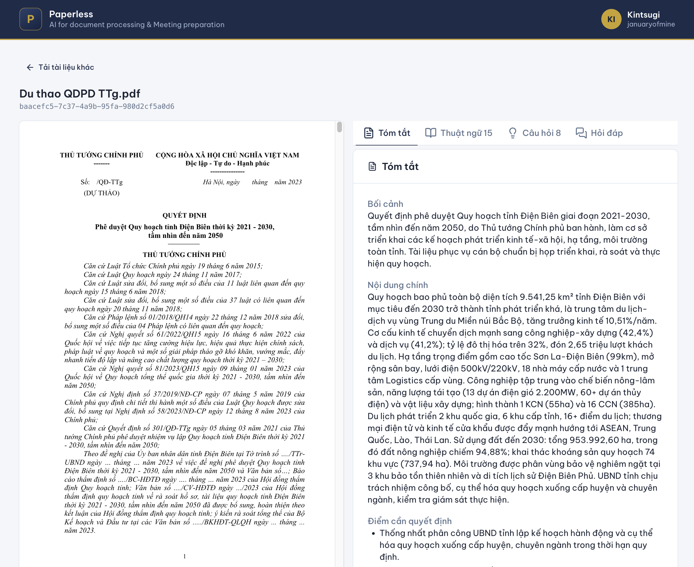
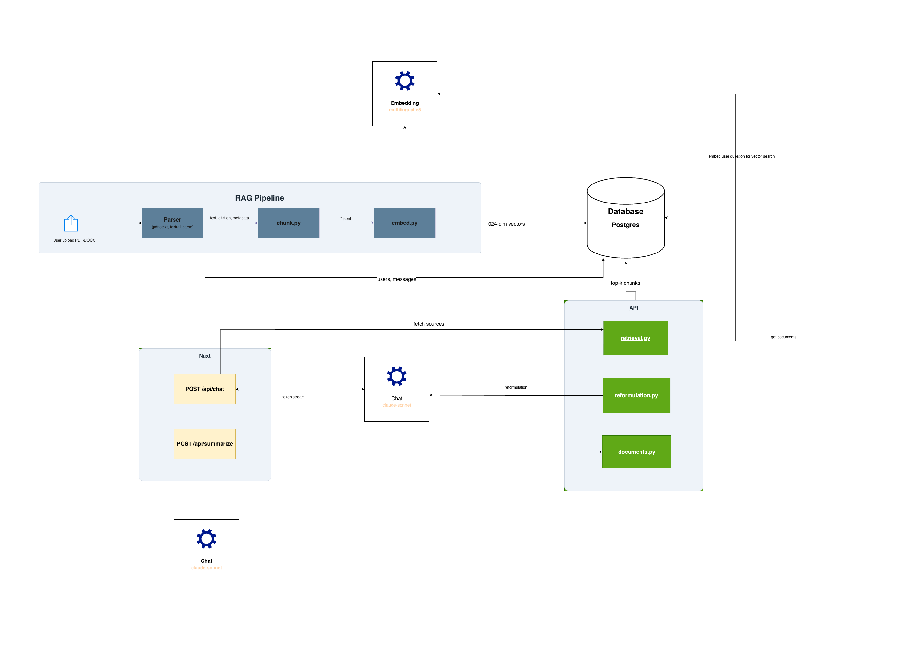

<div align="center">

# Paperless

**AI for document processing & meeting preparation** — built for the **VAIC 2026**.



</div>

## Problem Statement

Provincial-level meetings deal with 40–60-page documents full of specialized legal, administrative, and technical terminology. Officials often receive them just one day before. There is no time to read carefully, so meetings run long re-explaining the basics, and counter-points go unprepared.

This AI application lets an official **upload a document and, in under a minute, read, understand, and prepare** for the meeting. Every answer grounded in the source with page/section citations.

- [x] **1. Smart summarization**: upload a 40+ page PDF/DOCX -> a structured summary (_context · main content · decision points · impact_) in **< 60s**.
- [x] **2. Terminology highlight & explain**: detect **≥ 10** specialized legal/administrative terms and explain each correctly.
- [x] **3. Suggested critical questions**: auto-generate **≥ 5** quality counter-point questions from the document's content.
- [x] **4. Document-grounded Q&A**: ask in natural Vietnamese. The answer cites the specific **page / Điều-Khoản**.

## Architecture

Single monorepo.



#### Updates

- **Shared test-account login**: one-click demo sign-in (no OAuth), so everyone lands on the same owner and shares one document scope ([`73d9af0`](https://github.com/januaryofmine/VAIC2026/commit/73d9af0)).
- **Two-pane document reader**: the original PDF rendered with `vue-pdf-embed` (PDF.js) next to a four-tab prep-pack (summary · terms · questions · Q&A) ([`9e7bc63`](https://github.com/januaryofmine/VAIC2026/commit/9e7bc63)).
- **Direct browser → backend upload**: the BFF mints a short-lived **HMAC-SHA256** token (`<userId>.<exp>.<hmac>`, constant-time verify, identical bytes in Node & Python) so large files upload straight to the API and skip Vercel's 4.5 MB function-body limit, while the API key stays server-side ([`7546d99`](https://github.com/januaryofmine/VAIC2026/commit/7546d99)).
- **Persistent chat history**: `chat_sessions` + `chat_messages`. The full turn is saved atomically on stream finish, citations kept in JSONB ([`7e2b618`](https://github.com/januaryofmine/VAIC2026/commit/7e2b618)).
- **Prep-pack cache**: summary/terms/questions cached in a `prep_packs` JSONB table, so reopening a document costs **0 LLM calls** (≈35s → 0.02s) ([`0046d19`](https://github.com/januaryofmine/VAIC2026/commit/0046d19)).
- **Cloud ingest over HTTP**: browser → BFF → retrieval-api multipart proxy, guarded by an `X-API-Key` header ([`a17e19e`](https://github.com/januaryofmine/VAIC2026/commit/a17e19e)).
- **Apply new design system**: Nuxt UI custom `@theme` palette (navy `#1D2B4A` / gold `#C9A227`) ([`901422e`](https://github.com/januaryofmine/VAIC2026/commit/901422e)).
- **GitHub OAuth login**: `nuxt-auth-utils` sealed session cookie + idempotent user upsert into Postgres ([`b351501`](https://github.com/januaryofmine/VAIC2026/commit/b351501)).
- **One-command cloud deploy**: Supabase schema loader with pooler auto-detect (session ↔ transaction fallback) + a single Hugging Face Space Docker image (retrieval-api + rag-pipeline, `multilingual-e5-large` pre-downloaded at build for a <1s first request). ([`1a907f9`](https://github.com/januaryofmine/VAIC2026/commit/1a907f9)).
- **Original-file blob storage**: SHA-256 content-hash keys with a **race-safe partial unique index**: identical re-uploads dedup to one row, failed ones can retry; pluggable `BlobStorage` for a later S3 swap ([`ffa1712`](https://github.com/januaryofmine/VAIC2026/commit/ffa1712)).
- **Plan-and-fan-out Q&A**: decomposes a question into ≤5 self-contained sub-queries, each hits the hybrid retriever in parallel, results are **RRF-merged** and capped before synthesis. ([`9ef4aaf`](https://github.com/januaryofmine/VAIC2026/commit/9ef4aaf)).
- **Token/structure-aware chunking**: the `transformers` tokenizer packs ~400-token chunks (under e5's 512 limit) with ~15% trailing overlap. ([`36e2116`](https://github.com/januaryofmine/VAIC2026/commit/36e2116)).
- **Async ingestion with status polling**: a background `spawn` emits `document_id` before the slow embed step; the client polls `pending → parsing → embedding → ready` every 2s ([`f880481`](https://github.com/januaryofmine/VAIC2026/commit/f880481)).
- **Hybrid retrieval**: dense pgvector cosine + Postgres full-text (`tsvector` / prefix `tsquery`, Vietnamese stopword filter) over-fetched and fused with **Reciprocal Rank Fusion** (k=60), then ±1 **neighbor expansion** to recover context that spills across chunks ([`f9944d4`](https://github.com/januaryofmine/VAIC2026/commit/f9944d4)).
- **Map-reduce prep-pack**: a shared `mapReduce<T>` engine powers summary/terms/questions over 40–60 pages in **<60s**: character-grouped batches, concurrency-capped parallel calls, Zod-validated structured output ([`0f7e8b3`](https://github.com/januaryofmine/VAIC2026/commit/0f7e8b3), [`4eab81f`](https://github.com/januaryofmine/VAIC2026/commit/4eab81f)).
- **Streaming grounded Q&A**: AI SDK v6 `streamText` + `createUIMessageStream`; citations attached as `messageMetadata` and streamed live to `@ai-sdk/vue` ([`67ff2c6`](https://github.com/januaryofmine/VAIC2026/commit/67ff2c6), [`bf966e4`](https://github.com/januaryofmine/VAIC2026/commit/bf966e4)).
- **Two retrieval paths**: plain-fetch full document for prep-pack, vs. vector search scoped by `document_id` for Q&A ([`f05dd16`](https://github.com/januaryofmine/VAIC2026/commit/f05dd16), [`1728c05`](https://github.com/januaryofmine/VAIC2026/commit/1728c05)).
- **Multilingual embeddings + citation metadata**: `intfloat/multilingual-e5-large` (1024-dim, local torch) with `passage:` / `query:` prefixes and L2 normalization. Every chunk carries `page` (PDF) and `section` so answers cite the source ([`fc789a2`](https://github.com/januaryofmine/VAIC2026/commit/fc789a2)).
- **Basic Architecture**: Postgres 17 + pgvector schema (`vector(1024)`, cosine): users · documents · chunks · chat ([`29597aa`](https://github.com/januaryofmine/VAIC2026/commit/29597aa)).

## Project Structure

This is a monorepo with several moving parts.

| Directory                                      | Component         | Description                                                                                                                          |
| :--------------------------------------------- | :---------------- | :----------------------------------------------------------------------------------------------------------------------------------- |
| [`paperless-ui/`](./paperless-ui)              | UI / BFF          | Nuxt 4 app ([AI SDK](https://ai-sdk.dev/) v6): upload, prep-pack, streaming Q&A, GitHub OAuth. Proxies the Python API.               |
| [`retrieval-api/`](./retrieval-api)            | Retrieval Backend | [FastAPI](https://fastapi.tiangolo.com/) service: hybrid `/api/retrieve`, plain-fetch `/api/documents`, `/api/ingest`, `/api/users`. |
| [`rag-pipeline/`](./rag-pipeline)              | RAG Pipeline      | Parse → chunk → embed an uploaded PDF/DOCX into pgvector, preserving `page` + `section`.                                             |
| [`db/`](./db)                                  | Database          | Postgres 17 + [pgvector](https://github.com/pgvector/pgvector) schema (`init.sql`): users · documents · chunks · chat.               |
| [`deploy/`](./deploy)                          | Deployment        | Scripts to load the schema to Supabase and ship the API/UI to the cloud.                                                             |
| [`docker-compose.yaml`](./docker-compose.yaml) | Local DB          | Brings up Postgres + pgvector for local development.                                                                                 |

## LLMs

Runtime models are configurable via `runtimeConfig.ai` in [`paperless-ui/nuxt.config.ts`](./paperless-ui/nuxt.config.ts) and `retrieval-api/app/config.py`. Chat/summarization run on Anthropic through the AI SDK; embeddings run locally.

| Task                            | Model                            | Notes                                                    |
| :------------------------------ | :------------------------------- | :------------------------------------------------------- |
| Embedding (passage & query)     | `intfloat/multilingual-e5-large` | 1024-dim, local (torch). `passage:` / `query:` prefixes. |
| Summarize / Terms / Questions   | Claude Haiku 4.5                 | Cheap/fast per-chunk pass.                               |
| Summarize / Terms / Questions   | Claude Sonnet 4.6                | Quality structured output.                               |
| Chat (Q&A over document)        | Claude Sonnet 4.6                | Streamed, grounded, cites page/section.                  |
| Q&A search planning             | Claude Haiku 4.5                 | Plans the multi-query retrieval strategy.                |
| Query reformulation (retrieval) | Claude Haiku 4.5                 | Optional; `REFORMULATION_PROVIDER=none` = passthrough.   |

## RAG Pipeline

The pipeline grounds the LLM in the **user's uploaded document**. It preserves `page` (PDF) and `section` (`Điều`/`Khoản`, for legal documents) on every chunk so answers can cite them.

> [!NOTE]
> Requires the running Postgres database. See [Local Development](#local-development) for `docker-compose.yaml` setup.

To ingest a document directly from the CLI:

```bash
cd rag-pipeline
uv sync
source ../.env
uv run python ingest.py "<path to .pdf or .docx>"
```

## Local Development

Three services: **Postgres** (Docker), the **retrieval-api** (Python), and the **paperless-ui** (Nuxt).

### Step 1: Setup environment variables

- Copy `.env.sample` to `.env` and fill in your values. Most are self-explanatory.
- `NUXT_SESSION_PASSWORD` is a ≥ 32-character string used to encrypt and sign session cookies (`openssl rand -hex 24`).
- Set `ANTHROPIC_API_KEY` — required for summarization, terms, questions, and chat.

### Step 2: Create a GitHub OAuth App

The application only works when logged in, so create a GitHub OAuth App:

1. Create one at [github.com/settings/applications/new](https://github.com/settings/applications/new).
2. Set the callback URL to `http://localhost:3100/api/auth/github`.
3. Put the Client ID and Secret into `.env` (`NUXT_OAUTH_GITHUB_CLIENT_ID` / `NUXT_OAUTH_GITHUB_CLIENT_SECRET`).

### Step 3: Start Postgres

```bash
docker compose up -d
```

`db/init.sql` runs once on first boot (users · documents · chunks · chat, with the pgvector extension).

### Step 4: Start the retrieval-api

```bash
cd retrieval-api
uv sync
source ../.env
uv run uvicorn app.main:app --port 8001 --reload
```

### Step 5: Start the UI

```bash
cd paperless-ui
npm install
npm run dev   # http://localhost:3100
```

### Step 6: Open the browser

Open [http://localhost:3100](http://localhost:3100), **log in with GitHub**, then upload a 40+ page PDF/DOCX. The document ingests (parse → chunk → embed), and you get the summary, highlighted terms, suggested questions, and a grounded Q&A chat.

Each answer citing the specific page and `Điều`/`Khoản`.
